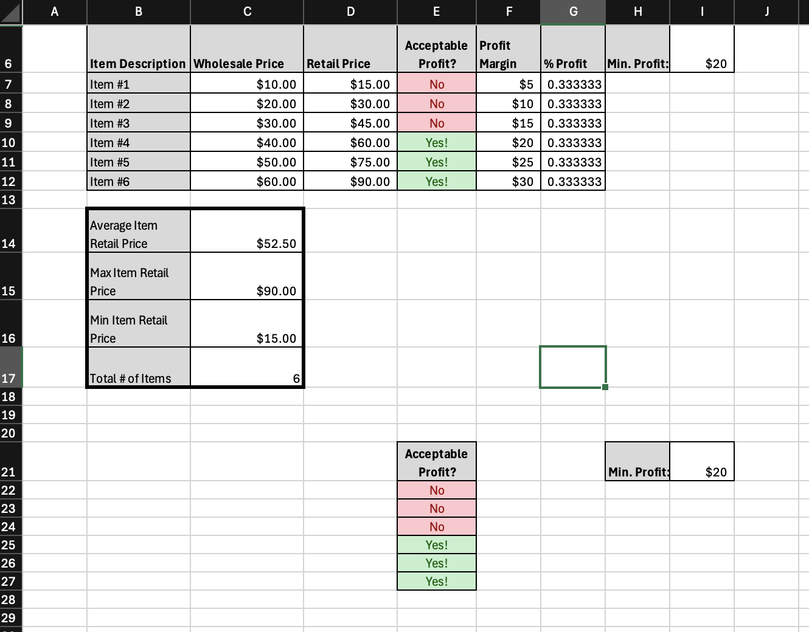

# Andrew_Majeski_Portfolio
This is a portfolio for Andrew Majeski.

 

# Title

### About Me 
Hello! I am an experienced in Finance and Economics professional with over 15 years of proven expertise in Tech and Cybersecurity. 

With skills in communication,  leadership, teamwork, and deal-making, I am able to establish unity within the workspace, and achieve success. I am adept at using Microsoft Excel, PowerPoint, and Github. 

My vast skill set, commitment to upholding an interconnected team, and passion for new technology make me as a valuable asset.  In my spare time, I like to listen to music and golf. 

You can find me on @andrewmajeski06 on Instagram or @drew.majeski on Indeed.

### Education 
BSc in Finance
Loyola University, MD

### Projects

#### Project 1 Title

This project was done through Konsole where I created a webpage using code. I learned how to access and create folders as well as create text through the Konsole on Mac.

***
#### Project 2 Title
 
This project was done to account a personal business. Through this project I learned how to better use Excel and manage supply and demand.

***
#### Project 3 Title
 
 This project was done using Apporto Virtual Lab. Using Microsoft Access I created a customer worksheet that compiled customers address, ID, and other identification to match then with a product.
